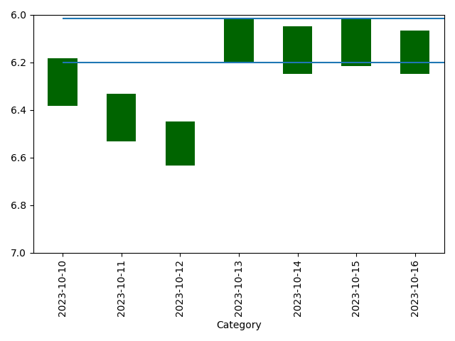

# Commuter Punctuality Chart

So my commuter train was so consistently late, I wanted to plot that timing to show it to everyone.

## usage

```
punctuality_chart.py [-h] [--train TRAIN] [--days DAYS] [--departure DEPARTURE] [--arrival ARRIVAL]

options:
  -h, --help            show this help message and exit
  --train TRAIN         The full train number to be checked. See bahn.expert for Regional Train full numbers
  --days DAYS           Number of days to look into the past
  --departure DEPARTURE
                        The departure station name
  --arrival ARRIVAL     The arrival station name
```

### Example

```
python .\punctuality-chart.py --train "S 38318" --days 7 --departure "Wiesloch-Walldorf" --arrival "Heidelberg Hbf"
```



## Dependencies

```
pip install -r .\requirements.txt
```